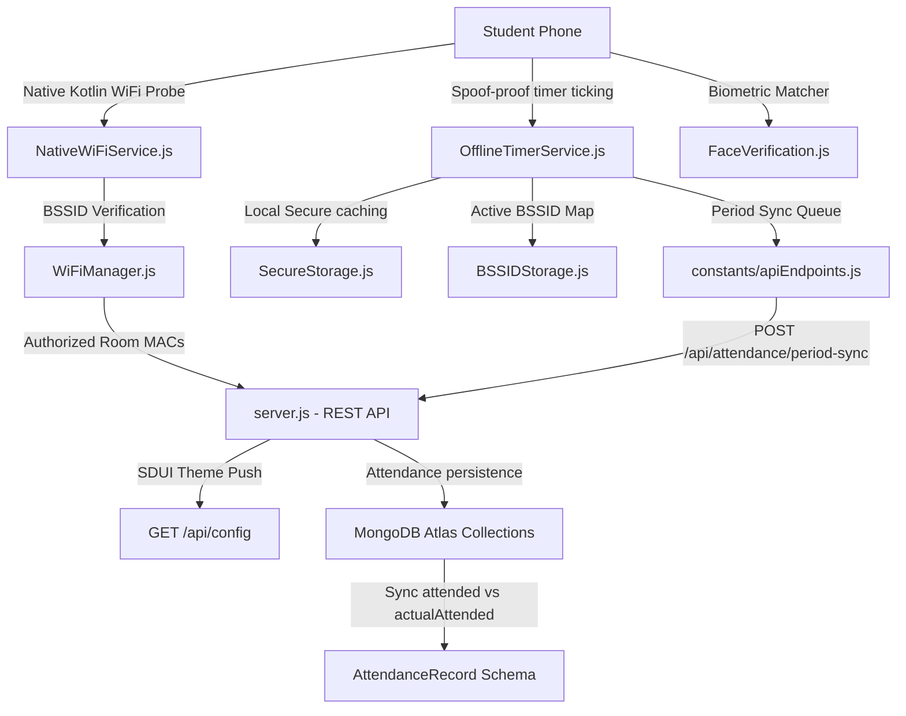

# 🏆 LetsBunk Subscription Ecosystem: Monetization Packages & Human Features

Welcome to the official **LetsBunk Monetization & Subscription Architecture**. This document details three tiers of structured, value-added subscription plans designed around the **LetsBunk** technical architecture. Each package is tailored to address specific student lifestyle needs ("human features") and administrative demands, backed by the low-level, high-integrity background verification pillars built into our codebase.

---

## 📊 Overview: LetsBunk Subscription Matrix

The following table summarizes the functional mapping, core codebase integrations, and pricing models across the LetsBunk ecosystem:

| Dimension / Feature | ☕ Bunk-Pilot (Free) | 🏃 Shuttle-Relay Plus (Pro) | 👑 Bunk-Overlord (Elite) |
| :--- | :--- | :--- | :--- |
| **Target Audience** | Casual everyday student | Collaborative student syndicates | The academic power strategist |
| **Pricing** | **$0.00 / Free** | **$2.99 / Month** | **$6.99 / Month** |
| **WiFi BSSID Scanning** | Single MAC validation | Shared BSSID Whitelists | Geofenced Autopilot Gateway |
| **Monotonic Security** | Monotonic uptime check | Period-transition token reuse | Keystore hardware resiliency |
| **Shuttle Relay Loop** | ❌ Standard Timer Only | ✅ Baseline Catch-Up (Up to 80%) | ✅ Unlimited Catch-Up (Up to 100%) |
| **Face Verification** | Re-verify per period | Enrolled embedding cached (7 Days) | Persistent offline Secure Keystore |
| **Grace Period** | 2 Minutes standard | 5 Minutes (Mid-tier booster) | 10 Minutes (Ultra-penetration) |
| **Liveness Random Ring** | Standard dialog check | Liveness predictive radar alert | WhatsApp / Telegram API webhooks |
| **P2P Verification** | ❌ Disabled | ✅ Encrypted Bluetooth Vouching | ✅ Syndicate validation routing |
| **Server-Driven UI (SDUI)** | Classic theme (`#0a1628`) | Glassmorphism skins (`#FF7675`) | Neon holographic templates (`#00DEC9`) |
| **Data Synchronization** | 5 Records cache | 30 Days cached buffer queue | Infinite resilient database queue |
| **Reporting & Analytics** | Basic calendar heatmap | AI predictive bunk engine stats | Institutional CSV/PDF reconciliation |

---

## 🛠️ A-to-Z Codebase & Architectural Scan

By auditing the LetsBunk codebase from backend servers to native Android modules, we have mapped out the precise interaction of components:



### Key Technical Pillars Audited:
1.  **Monotonic Elapsed Boot Time Verification:** Implemented inside [OfflineTimerService.js](file:///d:/bunk%20bssid/OfflineTimerService.js#L29-L64) via `TimerModule.getBootElapsedMs()`. By fetching Kotlin's `SystemClock.elapsedRealtime()`, LetsBunk bypasses local device time spoofing, ensuring students cannot cheat class durations by rewinding their phone clocks.
2.  **Server-Driven UI Layout Pushes:** Conducted via the dynamic `/api/config` router inside [server.js](file:///d:/bunk%20bssid/server.js#L541-L617), letting administrators change button text, backgrounds, and styling skins instantly without releasing new app store binaries.
3.  **Shuttle Relay (Attended vs. Actual-Attended Dynamics):** Tracks physical presence seconds separately from manual overrides. Scanned from [OfflineTimerService.js](file:///d:/bunk%20bssid/OfflineTimerService.js#L234-L238) and stored in the database [server.js](file:///d:/bunk%20bssid/server.js#L339-L340) inside `AttendanceRecord` as:
    *   `attended`: The effective duration registered on the university roster (often updated via manual mark overrides).
    *   `actualAttended`: The actual physical seconds verified locally by background BSSID loops.
4.  **Local Face Verification Cache:** Managed inside [OfflineTimerService.js](file:///d:/bunk%20bssid/OfflineTimerService.js#L495-L566) through [SecureStorage.js](file:///d:/bunk%20bssid/SecureStorage.js) so students can bypass real-time face matching if they have already validated their identity that day, or fallback to encrypted local embeddings during total internet failures.

---

## ☕ 1. Bunk-Pilot (The "Stay Safe" Tier)

> [!NOTE]
> Designed for the casual student who wants clean, reliable, and honest attendance tracking without administrative friction or premium automation overhead.

### 🌟 Human-Centric Value Proposition
Provides the essential, bulletproof foundation for everyday college life. It ensures the student's physical presence is recorded securely and automatically synced to the campus database as they sit in the classroom. It provides ultimate transparency, making sure professors can never claim a present student was absent.

### 🛠️ Core Technical Features & Codebase Intersections
*   **Standard BSSID Room Matching:** Connects to [WiFiManager.js](file:///d:/bunk%20bssid/WiFiManager.js) to resolve the active access point. Validates the MAC address against the current timetable block retrieved via [constants/apiEndpoints.js](file:///d:/bunk%20bssid/constants/apiEndpoints.js#L93) (`GET_TIMETABLE_BY_SEMESTER_BRANCH`).
*   **Monotonic Spoof-Proof Ticking:** Restricts counting strictly to active, validated elapsed ticks using `_getBootMs()` inside [OfflineTimerService.js](file:///d:/bunk%20bssid/OfflineTimerService.js#L54-L64).
*   **Standard 2-Minute WiFi Loss Grace Period:** Prevents attendance termination during typical campus WiFi dropouts, pausing the active local counting loop for exactly 120 seconds.
*   **Basic Offline Sync Queue:** Stores up to 5 offline lecture logs inside [SecureStorage.js](file:///d:/bunk%20bssid/SecureStorage.js) before syncing is halted, requiring students to regain active internet connections to flush the local queue.
*   **Visual Calendar Heatmap:** Access to the standard graphical calendar screen displaying daily and weekly attendance records color-coded green (present), orange (warning), and red (absent).
*   **Subject Limit:** Tracks up to 3 core subjects concurrently.
*   **Face Check Constraint:** Requires a fresh front-camera biometric facial match through [FaceVerification.js](file:///d:/bunk%20bssid/FaceVerification.js) at the start of *every single period* (no period-transition token recycling is allowed).

---

## 🏃 2. Shuttle-Relay Plus (The "Syndicate Captain" Tier)

> [!TIP]
> Built for collaborative students who coordinate their schedules, balance group targets, and keep their attendance records perfectly optimized above the mandatory 75% university threshold.

### 🌟 Human-Centric Value Proposition
Perfect for students who occasionally run late but want to keep their attendance record pristine. It integrates collaborative verification, smart predictive engines, and automated grace loops that make academic scheduling a precise, manageable science.

### 🛠️ Core Technical Features & Codebase Intersections
*   **Partner/Couple Shuttle Relay Loop:** Unlocks the actual-attendance catch-up mechanism! When a student is manually marked present (via a teacher override or peer vouch), they immediately receive the baseline credit on the server database. Meanwhile, the background timer inside [OfflineTimerService.js](file:///d:/bunk%20bssid/OfflineTimerService.js) continues running physically to catch up and advance their physical `actualTimerSeconds` to match or exceed the database override, securing their audit status.
*   **Peer-to-Peer Beacon Vouching:** If a student's WiFi fails the hardware BSSID validation due to campus network congestion or weak router signal, a classmate already verified inside the same classroom can generate an encrypted, time-stamped Bluetooth beacon vouch. This bypasses the WiFi drop and verifies the student's physical coordinates instantly.
*   **AI Bunk Predictor Engine:** Calculates the precise number of classes a student can safely skip based on current subject percentages, historic professor leniency patterns logged in `AttendanceAudit`, and remaining semester calendar dynamics.
*   **Random Ring Liveness Radar:** Predicts the most likely time-window for a teacher's random liveness prompt during a lecture using statistical averages from previous random ring timestamps (e.g., *"Historical logs indicate a 92% random-ring likelihood during the first 15 minutes of CS301"*).
*   **Day-Pass Face Verify Reuse:** Unlocks period-transition token sharing. Once the student completes their first face check in the morning, [OfflineTimerService.js](file:///d:/bunk%20bssid/OfflineTimerService.js#L269-L272) sets `verifiedToday = true` and skips all subsequent camera checks for the rest of that day's lectures.
*   **Syndicate Whitelist Sharing:** Automatically syncs verified room-BSSID MAC address modifications among syndicate members to keep local timetable mappings fully updated.
*   **Expanded 30-Day Sync Queue:** Caches up to 30 days of offline records locally, with automatic background synchronization retries.

---

## 👑 3. Bunk-Overlord (The "Syndicate Supreme" Tier)

> [!IMPORTANT]
> The ultimate defense suite for academic peace of mind. Provides complete automation, bulletproof database persistence, real-time administrative intelligence, and deep hardware integration.

### 🌟 Human-Centric Value Proposition
For the ultimate academic strategist who wants absolute peace of mind. It turns attendance tracking into a passive background process requiring zero manual interaction, while shielding the student's record with redundant hardware keys and real-time administrative intelligence.

### 🛠️ Core Technical Features & Codebase Intersections
*   **Auto-Pilot Geofence Gateway (Zero-Touch Tracking):** Starts and stops the foreground counting service automatically the millisecond the student crosses the geofenced BSSID classroom boundary—no manual button clicks, notifications, or app opening required!
*   **Keystore Hardware Resiliency:** Secures active timer values within Android's hardware-locked secure enclave. If the student's phone experiences a sudden battery drain, random reboot, or force-kill by aggressive OS battery-saving daemons, the service immediately recovers the exact countdown state on the next boot.
*   **Professor Override Webhook Integration:** Establishes a direct, high-priority WebSocket pipeline to the student. If a teacher accesses the manual override panel in the teacher dashboard [TeacherHeader.js](file:///d:/bunk%20bssid/TeacherHeader.js) or modifies an attendance record, the student receives an instant, high-priority push notification and a WhatsApp/Telegram alert showing the modification details.
*   **Extended 10-Minute Grace Period:** Extends the standard WiFi loss buffer to 10 minutes, protecting students sitting in basement labs, lecture halls with poor structural penetration, or campus dead-zones.
*   **Dynamic SDUI Lanyard Customization:** Fully unlocks premium customization of the Digital Student ID Card ([LanyardCard.js](file:///d:/bunk%20bssid/LanyardCard.js)), featuring live glowing glassmorphism borders, neon holographic templates, custom institutional badges, and dynamic student credentials.
*   **Enterprise Syndicate Dashboard:** Access to ad-free layouts, unlimited concurrent subject tracking, priority queue server synchronization, and institutional-grade spreadsheet exports (CSV/PDF) for academic coordinators.

---

## 🎨 Server-Driven UI (SDUI) Theme Configurations

Below are the exact JSON configurations pushed via the `/api/config` REST endpoint to render the specialized visual states for each tier:

````carousel
```json
{
  "theme": "Bunk-Pilot (Free)",
  "primaryColor": "#6C5CE7",
  "backgroundColor": "#0A1628",
  "accentColor": "#00DEC9",
  "glassmorphism": false,
  "lanyardCardStyle": "Standard Flat Color",
  "featuresAllowed": {
    "maxSubjects": 3,
    "p2pVouching": false,
    "shuttleRelay": false,
    "geofenceAutopilot": false,
    "overrideWebhooks": false
  }
}
```
<!-- slide -->
```json
{
  "theme": "Shuttle-Relay Plus (Pro)",
  "primaryColor": "#FF7675",
  "backgroundColor": "#0F0F13",
  "accentColor": "#FFEAA7",
  "glassmorphism": true,
  "lanyardCardStyle": "Dynamic Glass Card",
  "featuresAllowed": {
    "maxSubjects": 8,
    "p2pVouching": true,
    "shuttleRelay": true,
    "shuttleRelayLimit": 0.80,
    "geofenceAutopilot": false,
    "overrideWebhooks": false
  }
}
```
<!-- slide -->
```json
{
  "theme": "Bunk-Overlord (Elite)",
  "primaryColor": "#00DEC9",
  "backgroundColor": "#09090D",
  "accentColor": "#FF7675",
  "glassmorphism": true,
  "lanyardCardStyle": "Futuristic Neon Hologram",
  "featuresAllowed": {
    "maxSubjects": 99,
    "p2pVouching": true,
    "shuttleRelay": true,
    "shuttleRelayLimit": 1.00,
    "geofenceAutopilot": true,
    "overrideWebhooks": true
  }
}
```
````

---

## 🔒 Billing Verification & License Enforcement Logic

To secure these features, the backend utilizes dynamic validation middlewares inside [server.js](file:///d:/bunk%20bssid/server.js) that intercepts client check-ins and timers:

```javascript
// Middleware to enforce feature gateways based on subscription tier
async function checkSubscriptionLimit(req, res, next) {
    const { enrollmentNo } = req.body;
    
    try {
        const student = await StudentManagement.findOne({ enrollmentNo });
        if (!student) {
            return res.status(404).json({ success: false, error: 'Student profile not found.' });
        }
        
        const tier = student.subscriptionTier || 'free'; // 'free', 'pro', 'elite'
        
        // Example gating: Shuttle Relay Loop validation
        if (req.path.includes('/shuttle-relay') && tier === 'free') {
            return res.status(403).json({ 
                success: false, 
                error: 'Access Denied: Shuttle-Relay features require a Pro or Elite subscription.' 
            });
        }
        
        // Example gating: Autopilot Geofence endpoints
        if (req.path.includes('/geofence-autopilot') && tier !== 'elite') {
            return res.status(403).json({ 
                success: false, 
                error: 'Access Denied: Geofenced autopilot background gateways are restricted to Elite members.' 
            });
        }
        
        req.studentTier = tier;
        next();
    } catch (err) {
        res.status(500).json({ success: false, error: err.message });
    }
}
```

---

> [!TIP]
> *Empowering academic balance and high-integrity physical presence tracking, one period at a time.*  
> **LetsBunk Development Syndicate — 2026**
