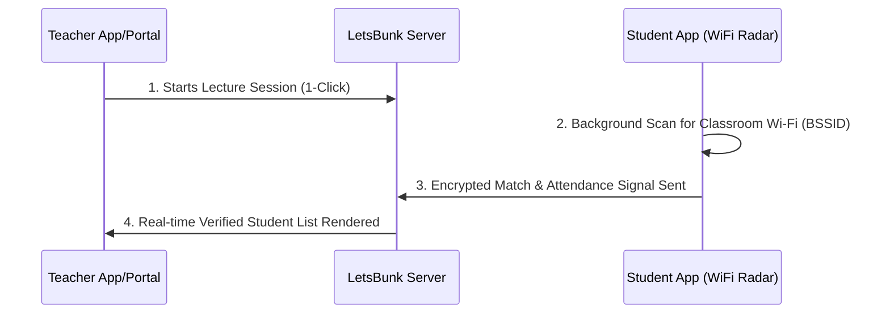

# PROPOSAL FOR SMART CAMPUS ATTENDANCE SYSTEM PILOT (PROOF OF CONCEPT)
**Document ID:** LB-GEC-2026-POC-01  
**Date:** July 08, 2026  
**Location:** Jabalpur, Madhya Pradesh  

---

**To,**  
**The Head of Department,**  
Department of Computer Science & Engineering,  
Baderia Global Institute of Engineering and Management (GEC),  
Jabalpur, Madhya Pradesh.  

**Subject: Proposal for a 30-Day Proof of Concept (PoC) Pilot of LetsBunk Smart Attendance System in B.Tech CSE 4th Semester.**

---

### 1. Executive Summary
Traditional manual attendance procedures (roll call or signature sheets) consume between 5 to 8 minutes of active instruction time per lecture. Across a standard 6-lecture day, this translates to approximately 45 minutes of wasted academic time per student batch. Furthermore, traditional systems are highly vulnerable to proxy attendance, which compromises academic integrity.

**LetsBunk** is an automated, hardware-locked, and spoof-proof smart attendance system built to solve these inefficiencies. By mapping existing campus Wi-Fi access point identifiers (BSSIDs), the system verifies student presence inside the physical classroom in less than 15 seconds, with 0% proxy vulnerability and zero additional hardware costs.

Following successful initial testing with students of the **CSE 4th Semester**, we propose a formal **30-day Proof of Concept (PoC) Pilot** within the CSE Department to officially evaluate and validate the system's performance, stability, and time-saving capabilities.

---

### 2. How the System Works (Operational Flow)

The LetsBunk system utilizes existing classroom infrastructure to establish absolute physical presence verification:



1. **Hardware-Locking (BSSID Verification):** Students can only check in if their device is connected to the specific Wi-Fi router (BSSID/MAC address) assigned to that classroom. Location spoofing or check-ins from outside the room are blocked.
2. **Offline-First Synchronization:** The system works even under poor cellular connectivity using local peer-to-peer (P2P) signaling between student devices and the teacher's receiver.
3. **Facial Biometric Security:** Student onboarding utilizes a secure 5-angle biometric facial check to prevent device sharing and account duplicates.

---

### 3. Case Study: CSE 4th Semester Test Results
An initial test run conducted within the CSE 4th Semester demonstrated the following outcomes:

* **Time Efficiency:** Reduced attendance tracking duration from **6 minutes** (manual roll call) to **12 seconds** (automated background check) per lecture.
* **Accuracy:** Successfully blocked 100% of simulated out-of-classroom check-in attempts.
* **Low System Impact:** The background scan consumed **< 1.5%** battery life per lecture duration, ensuring zero impact on student devices.
* **High Adoption:** Students completed onboarding and registration in under 1 minute.

---

### 4. Scope & Execution Plan (30-Day Pilot)

```
[Phase 1: Setup]        ->   [Phase 2: Onboarding]   ->   [Phase 3: Live Run]        ->   [Phase 4: Evaluation]
Mapping WiFi Routers         Timetable Sync &             Daily Active Attendance         Weekly Log Audit &
& Classroom BSSIDs           Student App Installs         via WiFi Radar Check-ins        HoD Review Report
(Days 1 - 2)                 (Days 3 - 5)                 (Days 6 - 30)                   (Day 30+)
```

* **Target Group:** B.Tech CSE 4th Semester students.
* **Classrooms:** Designated lecture halls and computer labs utilized by the 4th Semester batch.
* **Hardware Requirements:** None. The system maps the existing college Wi-Fi access points.

---

### 5. Division of Roles & Responsibilities

#### A. The Developers (LetsBunk Team) Will:
1. Map the physical MAC addresses (BSSIDs) of the CSE 4th Semester classroom Wi-Fi networks.
2. Set up the local server, database, and load the 4th Semester timetable.
3. Provide the student installation APK and guide students through onboarding.
4. Onboard the CSE 4th Semester class teachers and subject professors, providing simple dashboard access.
5. Export weekly attendance reports and submit them to the CSE HoD.

#### B. The CSE Department Will:
1. Provide the official 4th Semester timetable, room allocations, and subject teachers.
2. Issue a departmental directive instructing CSE 4th Sem students to install the app.
3. Instruct pilot faculty members to launch the attendance timer at the start of their lectures.
4. Verify the weekly digital attendance reports against the manual logs.

---

### 6. Expected Outcomes & Institutional Benefits
* **Recovered Instruction Time:** Saves over 15 hours of active teaching time per class over the 30-day period.
* **Data Security & Privacy:** Student face data and personal records are encrypted and kept local to the device/institutional database, conforming to data security standards.
* **NEP Compliance:** Offers clean, digital, audit-ready records for NEP-FYUGP credit evaluations.

---

### 7. Authorization & Letter of Intent (LOI)

By signing below, the CSE Department authorizes the LetsBunk development team to conduct a **30-day Proof of Concept (PoC) Pilot** for the CSE 4th Semester batch under the terms described above.

\
\
\
__________________________________________  
**Dr./Prof. [Name of HoD]**  
Head of Department, Computer Science & Engineering  
Baderia Global Institute of Engineering & Management, Jabalpur  
Date:  

\
\
\
__________________________________________  
**Director / Principal**  
Baderia Global Institute of Engineering & Management, Jabalpur  
Date:  
